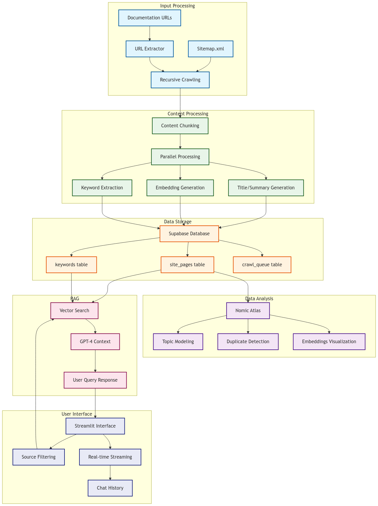

# RAGdoc - Documentation Crawler and RAG System

A comprehensive system for crawling technical documentation, extracting keywords, generating embeddings, and providing an interactive question-answering interface using RAG (Retrieval-Augmented Generation).

## Overview

This project consists of three main components:
1. A documentation crawler that fetches and processes web content
2. A keyword extraction system that identifies technical terms and definitions
3. A Streamlit-based UI for interactive question-answering

## Data Pipeline



## System Architecture

### 1. Crawler (`crawler.py`)
This is still a work in progress. Right now this does what it's supposed to do, but is poorly optimized and very slow. There's a lot of redundancy, batch processing and rate limiting are implemented manually so it's inefficient.

The crawler component is responsible for:
- Fetching documentation from specified websites
- Processing content into manageable chunks
- Generating embeddings for each chunk
- Storing processed data in Supabase

Key features:
- Parallel processing with rate limiting
- Support for sitemap.xml and recursive crawling
- Batch processing for API calls
- Error handling and retry mechanisms
- Queue-based crawling system

### 2. Keyword Extraction (`extract_keywords.py`)
This component:
- Processes documentation chunks to identify technical terms
- Extracts definitions for each term
- Uses GPT-4 for accurate keyword identification
- Stores keyword-definition pairs in Supabase

Features:
- Batch processing for efficient API usage
- Robust error handling
- Progress tracking
- Parallel processing capabilities

### 3. Conversation Agent (`agent.py`)
This is the main component of the system. It uses a combination of RAG, keyword extraction, and a conversation interface to answer questions about the documentation.

## Setup

### Prerequisites
- Python 3.8+

- Supabase account
- OpenAI API access
- Nomic API access (for embeddings visualization)

### Environment Variables
Create a `.env` file with:
```env
SUPABASE_URL=your_supabase_url
SUPABASE_SERVICE_KEY=your_supabase_key
OPENAI_API_KEY=your_openai_key
OPENROUTER_API_KEY=your_openrouter_key
OPENROUTER_API_BASE=your_openrouter_base
NOMIC_API_KEY=your_nomic_key
LLM_MODEL=gpt-4o-mini
```

### Installation
1. Clone the repository
2. Install dependencies:
```bash
pip install -r requirements.txt
```

## Database Schema

### Table: site_pages
- url: string (primary key)
- chunk_number: integer
- title: string
- summary: string
- content: text
- metadata: jsonb
- embedding: vector(1536)

### Table: keywords
- url: string (foreign key)
- chunk_number: integer
- keyword: string
- definition: text

### Table: crawl_queue
- url: string (primary key)
- status: string (pending/completed/failed)
- attempts: integer
- last_attempt: timestamp
- error_message: text

## Usage

### 1. Crawling Documentation
```bash
python crawler.py [url1] [url2] ...
```
If no URLs are provided, it will use the default URLs in the script.

### 2. Extracting Keywords
```bash
python extract_keywords.py
```
This will process all unprocessed chunks in the database.

### 3. Running the UI
```bash
streamlit run streamlit_ui.py
```
Access the UI through your browser at `http://localhost:8501`.

## Features

### Crawler Features
- Automatic sitemap detection
- Recursive crawling capability
- Parallel processing
- Rate limiting
- Error handling and retries
- Queue-based processing
- Content chunking
- Embedding generation

### Keyword Extraction Features
- GPT-4 powered extraction
- Batch processing
- Progress tracking
- Error handling
- Parallel processing

### UI Features
- Real-time streaming responses
- Source filtering
- Conversation history
- RAG-based answers
- Markdown support
- System message display

## Rate Limiting and Batch Processing

The system implements sophisticated rate limiting and batch processing:
- Configurable batch sizes
- Adjustable rate limits
- Automatic retries
- Error handling
- Progress tracking

## Acknowledgments

- Cole Medin's RAG Videos
- Cursor